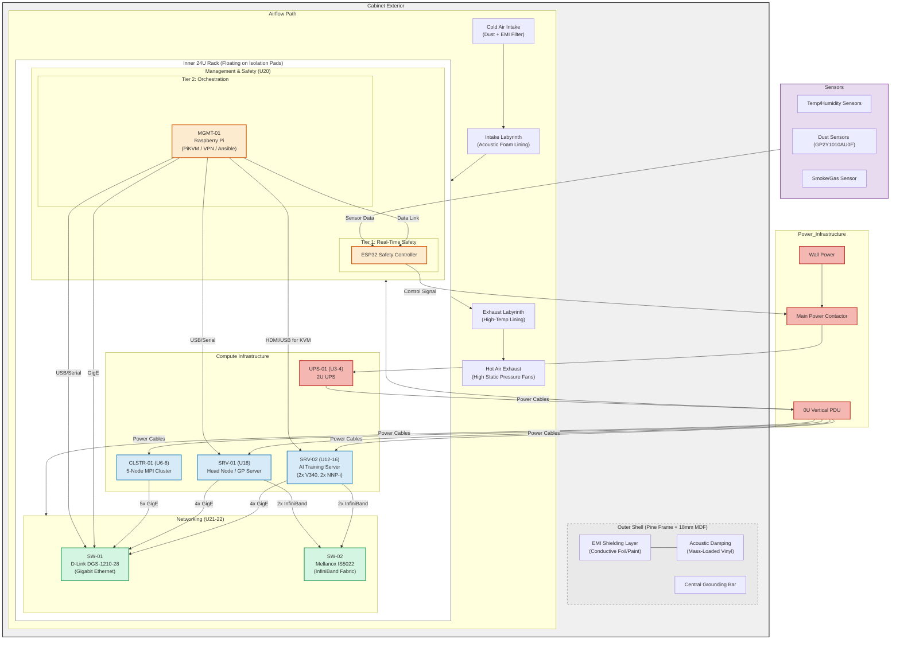

```mermaid
graph TD
    subgraph Acoustic_EMI_Shielded_Cabinet [Cabinet Exterior]
        direction LR
        style Acoustic_EMI_Shielded_Cabinet fill:#f0f0f0,stroke:#333,stroke-width:2px

        subgraph Airflow_Path [Airflow Path]
            direction TB
            A_Intake["Cold Air Intake<br/>(Dust + EMI Filter)"] --> B_Labyrinth_In["Intake Labyrinth<br/>(Acoustic Foam Lining)"]
            B_Labyrinth_In --> Inner_Rack
            Inner_Rack --> C_Labyrinth_Out["Exhaust Labyrinth<br/>(High-Temp Lining)"]
            C_Labyrinth_Out --> D_Exhaust["Hot Air Exhaust<br/>(High Static Pressure Fans)"]
        end

        subgraph Outer_Shell ["Outer Shell (Pine Frame + 18mm MDF)"]
            style Outer_Shell fill:#e9e9e9,stroke:#666,stroke-dasharray: 5 5
            E_Shielding["EMI Shielding Layer<br/>(Conductive Foil/Paint)"]
            F_Acoustic["Acoustic Damping<br/>(Mass-Loaded Vinyl)"]
            G_Ground[Central Grounding Bar]
            E_Shielding --- F_Acoustic
        end

        subgraph Inner_Rack ["Inner 24U Rack (Floating on Isolation Pads)"]
            direction TB
            style Inner_Rack fill:#ffffff,stroke:#333

            subgraph Compute_Nodes [Compute Infrastructure]
                SRV02["SRV-02 (U12-16)<br/>AI Training Server<br/>(2x V340, 2x NNP-i)"]
                SRV01["SRV-01 (U18)<br/>Head Node / GP Server"]
                CLSTR01["CLSTR-01 (U6-8)<br/>5-Node MPI Cluster"]
                UPS01["UPS-01 (U3-4)<br/>2U UPS"]
            end

            subgraph Networking ["Networking (U21-22)"]
                SW01["SW-01<br/>D-Link DGS-1210-28<br/>(Gigabit Ethernet)"]
                SW02["SW-02<br/>Mellanox IS5022<br/>(InfiniBand Fabric)"]
            end

            subgraph Management_System ["Management & Safety (U20)"]
                direction TB
                subgraph Tier2 [Tier 2: Orchestration]
                    RPi["MGMT-01<br/>Raspberry Pi<br/>(PiKVM / VPN / Ansible)"]
                end
                subgraph Tier1 [Tier 1: Real-Time Safety]
                    ESP32["ESP32 Safety Controller"]
                end
            end

            %% Data Connections
            SRV02 -- 4x GigE --> SW01
            SRV01 -- 4x GigE --> SW01
            CLSTR01 -- 5x GigE --> SW01
            RPi -- GigE --> SW01

            SRV02 -- 2x InfiniBand --> SW02
            SRV01 -- 2x InfiniBand --> SW02

        end
    end

    %% Power Flow
    subgraph Power_Infrastructure
        direction TB
        Wall_Power["Wall Power"] --> Power_Contactor["Main Power Contactor"]
        Power_Contactor --> UPS01
        UPS01 --> PDU["0U Vertical PDU"]
        PDU -- Power Cables --> SRV01
        PDU -- Power Cables --> SRV02
        PDU -- Power Cables --> CLSTR01
        PDU -- Power Cables --> Networking
        PDU -- Power Cables --> Management_System
    end

    %% Management & Control Connections
    RPi -- USB/Serial --> SW01
    RPi -- USB/Serial --> SRV01
    RPi -- HDMI/USB for KVM --> SRV02
    RPi -- Data Link --> ESP32

    ESP32 -- Control Signal --> Power_Contactor
    subgraph Sensors
        direction LR
        Temp_Humidity["Temp/Humidity Sensors"]
        Dust_Sensors["Dust Sensors (GP2Y1010AU0F)"]
        Smoke_Sensor["Smoke/Gas Sensor"]
    end
    Sensors -- Sensor Data --> ESP32

    %% Styling
    classDef server fill:#d6eaf8,stroke:#2980b9,stroke-width:2px;
    classDef network fill:#d5f5e3,stroke:#229954,stroke-width:2px;
    classDef management fill:#fdebd0,stroke:#d35400,stroke-width:2px;
    classDef power fill:#f5b7b1,stroke:#c0392b,stroke-width:2px;
    classDef sensor fill:#e8daef,stroke:#884ea0,stroke-width:2px;

    class SRV01,SRV02,CLSTR01 server;
    class SW01,SW02 network;
    class RPi,ESP32 management;
    class UPS01,PDU,Power_Contactor,Wall_Power power;
    class Sensors sensor;

```