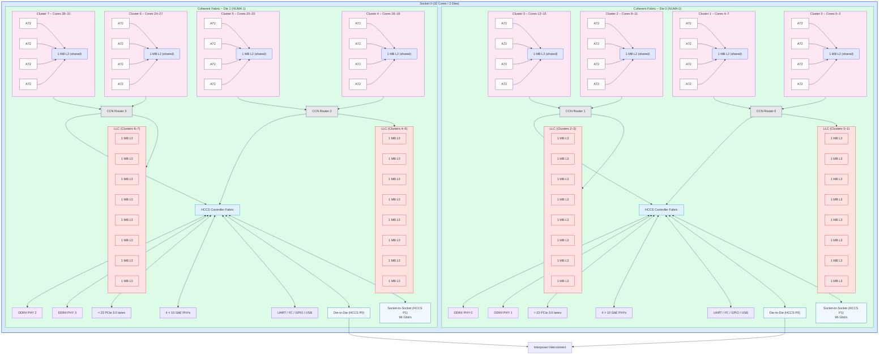

# Kunpeng 916 MCM Diagram

```mermaid
graph TD;
%% Kunpeng 916 – 32 Cores / 2 Dies (Full Chip)

subgraph Socket0["Socket 0 (32 Cores / 2 Dies)"]
    direction TB

    %% ──────────────────────── Die 0 / NUMA 0 ────────────────────────
    subgraph Fabric0["Coherent Fabric – Die 0  (NUMA 0)"]
        direction TB

        DDR0["DDR4 PHY 0"]
        DDR1["DDR4 PHY 1"]

        %% Four core-clusters (0-3)
        %% ————————————————————
        subgraph Cluster0["Cluster 0 ‒ Cores 0–3"]
            C0["A72"]:::core --> L2CL0
            C1["A72"]:::core --> L2CL0
            C2["A72"]:::core --> L2CL0
            C3["A72"]:::core --> L2CL0
            L2CL0["1 MB L2 (shared)"]:::l2
            %%C0 --> L2CL0 & C1 --> L2CL0 & C2 --> L2CL0 & C3 --> L2CL0
        end

        subgraph Cluster1["Cluster 1 ‒ Cores 4–7"]
            C4["A72"]:::core --> L2CL1
            C5["A72"]:::core --> L2CL1
            C6["A72"]:::core --> L2CL1
            C7["A72"]:::core --> L2CL1
            L2CL1["1 MB L2 (shared)"]:::l2
        end

        subgraph Cluster2["Cluster 2 ‒ Cores 8–11"]
            C8["A72"]:::core --> L2CL2
            C9["A72"]:::core --> L2CL2
            C10["A72"]:::core --> L2CL2
            C11["A72"]:::core --> L2CL2
            L2CL2["1 MB L2 (shared)"]:::l2
        end

        subgraph Cluster3["Cluster 3 ‒ Cores 12–15"]
            C12["A72"]:::core --> L2CL3
            C13["A72"]:::core --> L2CL3
            C14["A72"]:::core --> L2CL3
            C15["A72"]:::core --> L2CL3
            L2CL3["1 MB L2 (shared)"]:::l2
        end

        %% L3 slices
        subgraph LLC0["LLC (Clusters 0–1)"]
            direction LR
            LLC0C0["1 MB L3"]:::llc
            LLC0C1["1 MB L3"]:::llc
            LLC0C2["1 MB L3"]:::llc
            LLC0C3["1 MB L3"]:::llc
            LLC0C4["1 MB L3"]:::llc
            LLC0C5["1 MB L3"]:::llc
            LLC0C6["1 MB L3"]:::llc
            LLC0C7["1 MB L3"]:::llc
        end
        subgraph LLC1["LLC (Clusters 2–3)"]
            direction LR
            LLC1C8["1 MB L3"]:::llc
            LLC1C9["1 MB L3"]:::llc
            LLC1C10["1 MB L3"]:::llc
            LLC1C11["1 MB L3"]:::llc
            LLC1C12["1 MB L3"]:::llc
            LLC1C13["1 MB L3"]:::llc
            LLC1C14["1 MB L3"]:::llc
            LLC1C15["1 MB L3"]:::llc
        end

        CCNRouter0["CCN Router 0"]:::router
        CCNRouter1["CCN Router 1"]:::router
        Cluster0 & Cluster1 --> CCNRouter0
        Cluster2 & Cluster3 --> CCNRouter1
        CCNRouter0 --> LLC0
        CCNRouter1 --> LLC1

        %% IO & inter-die fabric
        HCCSxD0["HCCS Controller Fabric"]:::hccs
        PCIe0["≈ 23 PCIe 3.0 lanes"]:::io
        ETH0["4 × 10 GbE PHYs"]:::io
        PER0["UART / I²C / GPIO / USB"]:::io
        HCCSxD0 <--> DDR0
        HCCSxD0 <--> DDR1
        HCCSxD0 <--> PCIe0
        HCCSxD0 <--> ETH0
        HCCSxD0 <--> PER0

        HCCS0["Die-to-Die (HCCS P0)"]:::link
        HCCS1["Socket-to-Socket (HCCS P1)<br/>96 Gbit/s"]:::link
        HCCSxD0 <--> HCCS0 
        HCCSxD0 <--> HCCS1

        CCNRouter0 & CCNRouter1 --> HCCSxD0
    end


    %% ──────────────────────── Die 1 / NUMA 1 ────────────────────────
    subgraph Fabric1["Coherent Fabric – Die 1  (NUMA 1)"]
        direction TB

        DDR2["DDR4 PHY 2"]
        DDR3["DDR4 PHY 3"]

        subgraph Cluster4["Cluster 4 ‒ Cores 16–19"]
            C16["A72"]:::core --> L2CL4
            C17["A72"]:::core --> L2CL4
            C18["A72"]:::core --> L2CL4
            C19["A72"]:::core --> L2CL4
            L2CL4["1 MB L2 (shared)"]:::l2
        end

        subgraph Cluster5["Cluster 5 ‒ Cores 20–23"]
            C20["A72"]:::core --> L2CL5
            C21["A72"]:::core --> L2CL5
            C22["A72"]:::core --> L2CL5
            C23["A72"]:::core --> L2CL5
            L2CL5["1 MB L2 (shared)"]:::l2
        end

        subgraph Cluster6["Cluster 6 ‒ Cores 24–27"]
            C24["A72"]:::core --> L2CL6
            C25["A72"]:::core --> L2CL6
            C26["A72"]:::core --> L2CL6
            C27["A72"]:::core --> L2CL6
            L2CL6["1 MB L2 (shared)"]:::l2
        end

        subgraph Cluster7["Cluster 7 ‒ Cores 28–31"]
            C28["A72"]:::core --> L2CL7
            C29["A72"]:::core --> L2CL7
            C30["A72"]:::core --> L2CL7
            C31["A72"]:::core --> L2CL7
            L2CL7["1 MB L2 (shared)"]:::l2
        end

        subgraph LLC2["LLC (Clusters 4–5)"]
            direction LR
            LLC2C0["1 MB L3"]:::llc
            LLC2C1["1 MB L3"]:::llc
            LLC2C2["1 MB L3"]:::llc
            LLC2C3["1 MB L3"]:::llc
            LLC2C4["1 MB L3"]:::llc
            LLC2C5["1 MB L3"]:::llc
            LLC2C6["1 MB L3"]:::llc
            LLC2C7["1 MB L3"]:::llc
        end
        subgraph LLC3["LLC (Clusters 6–7)"]
            direction LR
            LLC3C8["1 MB L3"]:::llc
            LLC3C9["1 MB L3"]:::llc
            LLC3C10["1 MB L3"]:::llc
            LLC3C11["1 MB L3"]:::llc
            LLC3C12["1 MB L3"]:::llc
            LLC3C13["1 MB L3"]:::llc
            LLC3C14["1 MB L3"]:::llc
            LLC3C15["1 MB L3"]:::llc
        end

        CCNRouter2["CCN Router 2"]:::router
        CCNRouter3["CCN Router 3"]:::router
        Cluster4 & Cluster5 --> CCNRouter2
        Cluster6 & Cluster7 --> CCNRouter3
        CCNRouter2 --> LLC2
        CCNRouter3 --> LLC3

        HCCSxD1["HCCS Controller Fabric"]:::hccs
        PCIe1["≈ 23 PCIe 3.0 lanes"]:::io
        ETH1["4 × 10 GbE PHYs"]:::io
        PER1["UART / I²C / GPIO / USB"]:::io
        HCCSxD1 <--> DDR2
        HCCSxD1 <--> DDR3
        HCCSxD1 <--> PCIe1
        HCCSxD1 <--> ETH1
        HCCSxD1 <--> PER1

        HCCS2["Die-to-Die (HCCS P0)"]:::link
        HCCS3["Socket-to-Socket (HCCS P1)<br/>96 Gbit/s"]:::link
        HCCSxD1 <--> HCCS2
        HCCSxD1 <--> HCCS3

        CCNRouter2 & CCNRouter3 --> HCCSxD1
    end

    %% Die-to-Die (internal) link
    %% 
end

IIC0["Interposer Interconnect"]

HCCS0 --> IIC0
HCCS2 --> IIC0


%% ──────────────────────── Styling ────────────────────────
classDef socket      fill:#dbeafe,stroke:#2563eb,stroke-width:2px;
classDef fabric      fill:#dcfce7,stroke:#16a34a,stroke-width:1px;
classDef fabricAlt   fill:#fef3c7,stroke:#d97706,stroke-width:1px,stroke-dasharray:5;
classDef cluster     fill:#fce7f3,stroke:#c026d3,stroke-width:1px;
classDef l2          fill:#e0e7ff,stroke:#4f46e5,stroke-width:1px;
classDef llc         fill:#fee2e2,stroke:#dc2626,stroke-width:1px; 
classDef hccs        fill:#e0f2fe,stroke:#0284c7,stroke-width:1px;
classDef link        fill:#f0f9ff,stroke:#0369a1,stroke-width:1px; 
classDef io          fill:#ede9fe,stroke:#7c3aed,stroke-width:1px; 
classDef mem         fill:#f3e8ff,stroke:#8b5cf6,stroke-width:1px; 
classDef router      fill:#e5e7eb,stroke:#374151,stroke-width:1px;
classDef core        fill:#ffffff,stroke:#4b5563,stroke-width:1px,fill-opacity:0.8;

class Socket0 socket;
class Fabric0 fabric;
class Fabric1 fabric;
class DDR0,DDR1,DDR2,DDR3 mem;
class Cluster0,Cluster1,Cluster2,Cluster3,Cluster4,Cluster5,Cluster6,Cluster7 cluster;
class L2CL0,L2CL1,L2CL2,L2CL3,L2CL4,L2CL5,L2CL6,L2CL7 l2;
class LLC0,LLC1,LLC2,LLC3 llc;
```
